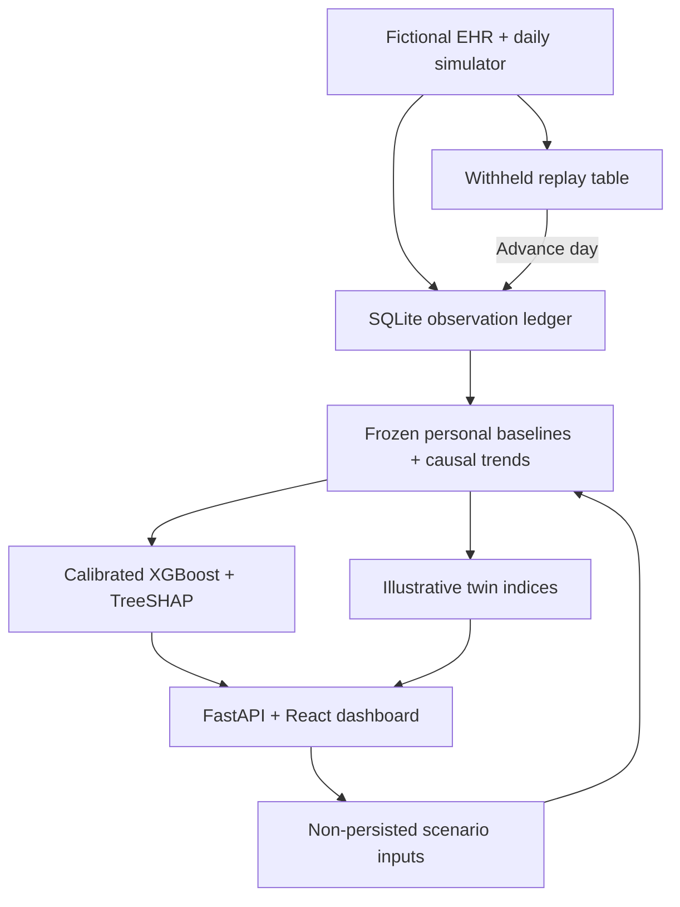

# Architecture

`simulation.py` produces patients, observations and separate outcomes. `features.py` uses the same feature schema for fast training batches and causal live inference; tests enforce numerical equivalence. `model.py` trains six models, evaluates untouched test patients and loads native JSON XGBoost objects. `twin.py` packages predictions, SHAP, baseline deltas, coverage and indices. `store.py` persists observations and isolates withheld replay. `api.py` exposes the API and serves the compiled React client.

## API

All routes use `/api`. Visit `/docs` for request schemas and interactive examples.

| Method | Path | Behavior |
| --- | --- | --- |
| GET | `/health` | Ready model status |
| GET / POST | `/patients` | Ranked cohort / create fictional EHR patient |
| GET | `/patients/{id}` | EHR profile and current twin |
| GET | `/patients/{id}/twin` | Current risk, signals, quality, indices |
| GET | `/patients/{id}/risk` | Seven-day synthetic probability, threshold and explanation |
| GET | `/patients/{id}/timeline?days=21` | Past observations and causal historical risk; 1–90 days |
| GET | `/patients/{id}/explanation` | Additive calibrated TreeSHAP explanation |
| POST | `/patients/{id}/telemetry` | Validate and append next daily reading |
| POST | `/patients/{id}/simulate` | Non-persisted one-day physiological perturbation |
| POST | `/demo/advance` | Append available next-day replay readings |
| POST | `/demo/reset` | Restore the original fictional cohort |
| GET | `/evaluation` | Actual held-out benchmark JSON |

Telemetry is daily aggregated data, not a raw sub-second wearable stream. Timestamp must be exactly the next calendar day after the patient's last observation. At least one signal is required. Missing fields are stored as missing; no invisible forward-fill occurs. Clinical input ranges are not implied by simulator acceptance ranges.

New patients begin without inference. Risk requires day >14, seven baseline observations per signal, at least 50% sensor coverage in the past week, and at least 50% current-day coverage. SQLite enforces unique patient/day records and persists across restarts. Reset deletes demo/manual entries only after explicit UI confirmation. The API has no authentication; use locally with fictional inputs.

Caches are in-process, keyed by patient and immutable observation day. This demo supports a single server process. Advancing/resetting the demo clears caches. Training artifacts include a config hash; changing baseline or simulation settings requires retraining before serving.
